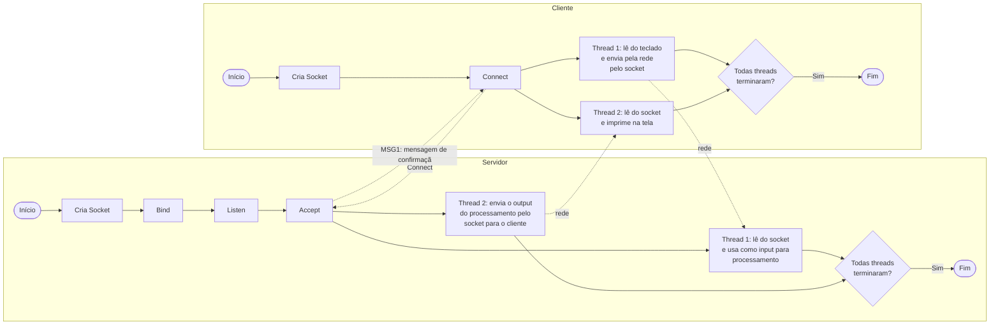

# 💬 Chat-Multiusuario

Uma sala de bate-papo multiusuário implementada em arquitetura cliente-servidor, onde vários usuários podem se comunicar enviando mensagens públicas entre si.

> **Status atual:** primeira atividade — suporte a **um único usuário** conectado ao servidor.

---

## 📋 Como funciona

1. O usuário, através do **cliente**, inicia a conexão com o **servidor**.
2. Ao conectar, o cliente recebe imediatamente a mensagem:
   ```
   : CONECTADO!!
   ```
   *(identificada como `MSG1` no diagrama)*
3. Duas *threads* são criadas em cada ponta (cliente e servidor) para lidar com a conexão através do *handle* que a identifica:

| Processo | Thread 1 | Thread 2 |
|---|---|---|
| **Servidor** | Recebe comandos/mensagens do cliente e os armazena em memória compartilhada | A cada minuto, envia data/horário ao cliente e varre a memória compartilhada, executando as ações solicitadas |
| **Cliente** | Aguarda o usuário digitar comandos/mensagens e os envia ao servidor | Recebe e imprime na tela a data/horário enviada periodicamente pelo servidor |

O envio da data/horário pela thread 2 do servidor ocorre **independentemente** de o chat estar ocioso ou de haver troca de mensagens no canal.

---

## ⌨️ Comandos do cliente

Digitados na thread 1 do cliente e enviados ao servidor:

| Comando | Descrição |
|---|---|
| `:nome` | Altera o nome do usuário |
| `:quit` | Encerra o aplicativo |

> 💡 Qualquer texto que **inicie com `:`** (dois pontos) é interpretado como **comando**. Caso contrário, é tratado como **mensagem** a ser enviada a todos os usuários.

---

## 🧾 Regras de formatação

- **Nome padrão:** se o usuário não definir um nome, será usado automaticamente `SEU_IP:PORTA_DO_CLIENTE`.
- **Mensagem recebida** (exibida para os demais usuários):
  ```
  NOME_DO_USUARIO (horário): MENSAGEM
  ```
- **Eco para quem enviou:**
  ```
  Voce digitou: MENSAGEM
  ```

---

## 🏗️ Arquitetura

### Diagrama de fluxos



*Nas duas pontas, quando a checagem "Todas threads terminaram?" responde **Não**, o processo continua no loop infinito das threads até que ambas encerrem.*

### Resumo do fluxo

1. **Servidor:** cria o *socket*, faz `bind`, entra em `listen` e aguarda em `accept`.
2. **Cliente:** cria o *socket* e executa `connect` até o servidor.
3. Assim que a conexão é aceita, o servidor responde com a **mensagem de confirmação** (`MSG1`: `: CONECTADO!!`).
4. A partir daí, cada ponta dispara duas *threads* que rodam em loop infinito até que ambas terminem:
   - **Cliente — Thread 1:** lê o teclado e envia pela rede.
   - **Cliente — Thread 2:** lê do socket e imprime na tela.
   - **Servidor — Thread 1:** lê do socket e usa como *input* para processamento (comandos/mensagens armazenados na estrutura de dados em memória compartilhada).
   - **Servidor — Thread 2:** envia pelo socket, ao cliente, o *output* do processamento (data/horário periódicos, mensagens de broadcast etc.).
5. Quando todas as threads de um lado terminam, o processo correspondente é encerrado (`Fim`).

---

## 📌 Roadmap

- [ ] Suporte a múltiplos usuários simultâneos
- [ ] Broadcast de mensagens entre todos os clientes conectados
